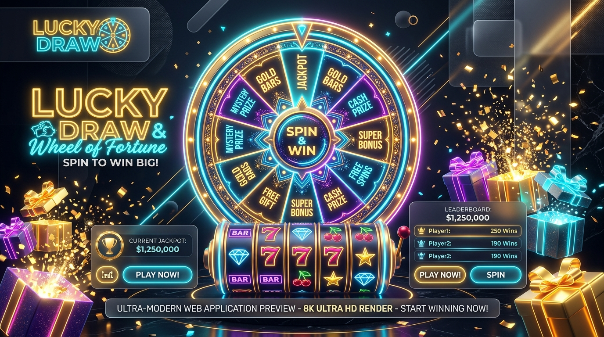

# 🎰 Lucky Draw & Wheel of Fortune

<div align="center">



**The ultimate interactive suite for event giveaways, team raffles, prize draws, and party games.**  
*Zero external dependencies • 100% offline-ready • Built with Vanilla JS & Web Audio API.*

[](https://opensource.org/licenses/MIT)
[](https://developer.mozilla.org/en-US/docs/Web/HTML)
[](https://developer.mozilla.org/en-US/docs/Web/CSS)
[](https://developer.mozilla.org/en-US/docs/Web/JavaScript)
[](https://developer.mozilla.org/en-US/docs/Web/API/Web_Audio_API)

</div>

---

## ✨ Features Overview

### 🎡 1. The Grand Fortune Wheel
- High-DPI canvas rendering with glowing outer neon rim and flashing LED bulbs.
- Realistic quintic-easing physics deceleration with spring-loaded pointer bounce.
- Dynamic segment sizing with auto-fitted typography and custom prize colors.
- Real-time ratchet click sounds synchronized with each segment boundary.

### 🎰 2. Vegas Slot Machine
- 3 illuminated vertical mechanical reels with metallic bezels.
- Realistic interactive side lever with 3D pull mechanics.
- Staggered reel deceleration (Reel 1, Reel 2, Reel 3) for suspenseful reveals.
- Heavy mechanical thud sound effects on each lock.

### 📦 3. 3D Mystery Gift Boxes
- Grid of glowing 3D flip-card mystery chests with golden ribbons.
- Click any individual box to trigger shake animation and uncover the hidden prize.
- Or hit "Random Box Pick" to cycle lights and automatically select a winner.

### ⚡ 4. Rapid Multi-Winner Draw
- High-speed digital shuffle screen for bulk draws (1, 2, 3, 5, or 10 winners simultaneously).
- Instant lock-in countdown sound effects.
- Celebratory Gold 🥇, Silver 🥈, and Bronze 🥉 podium cards.

---

## 🚀 Advanced Capabilities

- 🔊 **Procedural Web Audio Engine**: Zero external MP3 files! Ratchet clicks, reel thuds, victory fanfares, and jackpot bells are generated 100% via the Web Audio API.
- 🎊 **Confetti & Particle Cannon**: Multi-colored ribbons, stars, and sparklers with realistic physics and gravity.
- 👥 **Participant & Prize Management**:
  - Bulk import names via comma or line separation.
  - Built-in presets: *Tech & Gadgets*, *Office Party & Perks*, *Cash & Jackpots*, *Participants*, and *Lucky Numbers*.
  - Individual item toggle, color indicators, and elimination toggle (prevent duplicate winners).
- 📊 **Winner Log & CSV Export**:
  - Live history drawer recording all winners with timestamps and game modes.
  - One-click export to CSV spreadsheet.
- ⚙️ **Event Branding**:
  - Customize event title and subtitle directly from the settings drawer.
  - Fullscreen mode support (`F`) for stage screens, projectors, and live streams.

---

## ⌨️ Keyboard Shortcuts

| Key | Action |
| :--- | :--- |
| <kbd>Space</kbd> / <kbd>Enter</kbd> | Spin Wheel / Pull Slot Lever / Pick Mystery Box / Start Draw |
| <kbd>1</kbd> - <kbd>4</kbd> | Switch Game Mode (1: Wheel, 2: Slots, 3: Boxes, 4: Rapid) |
| <kbd>M</kbd> | Toggle Sound Effects Mute / Unmute |
| <kbd>F</kbd> | Toggle Fullscreen Mode |
| <kbd>Esc</kbd> | Close any open modal or drawer |

---

## 🛠️ Quick Start

No installation or build steps required! Simply open the project in any modern web browser:

1. Clone or download the repository:
   ```bash
   git clone https://github.com/<your-username>/Lucky-Draw.git
   cd Lucky-Draw
   ```
2. Open `index.html` in your browser:
   - On Windows: Double-click `index.html` or run `start index.html` in PowerShell.
   - Or serve with any static web server (e.g. `npx serve`, `python -m http.server 8000`, or Live Server extension).

---

## 🌐 How to Push to GitHub

If you're creating a new remote repository on GitHub:

1. Create a new empty repository on [GitHub](https://github.com/new) named **Lucky-Draw**.
2. Run the following commands in your terminal:
   ```bash
   cd c:\Users\ANITESH\Documents\GitHub\Lucky-Draw
   git remote add origin https://github.com/<YOUR-USERNAME>/Lucky-Draw.git
   git branch -M main
   git push -u origin main
   ```

---

## 📁 Project Structure

```
Lucky-Draw/
├── index.html        # Main application layout, game views & modals
├── style.css         # Modern dark luxury glassmorphism design system
├── README.md         # Documentation and guide
├── .gitignore        # Git ignore rules
├── assets/
│   └── banner.jpg    # Application preview banner
└── js/
    ├── audio.js      # Web Audio API sound synthesizer
    ├── confetti.js   # Canvas particle celebration engine
    ├── state.js      # LocalStorage state, presets & CSV export
    ├── wheel.js      # Fortune Wheel canvas engine with physics
    ├── slots.js      # Vegas Slot Machine reel engine
    ├── raffle.js     # Mystery Box 3D & Rapid Multi-Draw engines
    └── app.js        # Main coordinator, events & keyboard shortcuts
```

---

## 📄 License

Distributed under the MIT License. Feel free to use, modify, and distribute for personal or commercial events!
